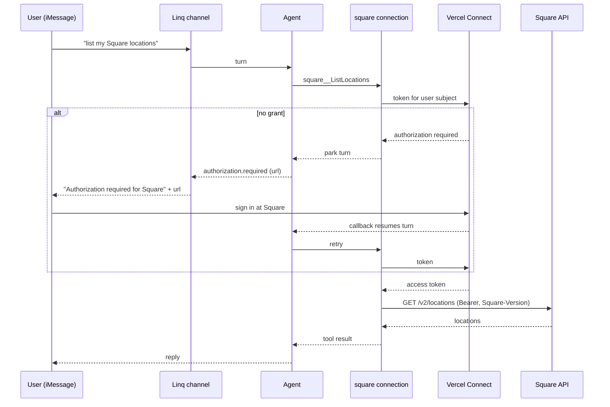

# Square Per-User Connection - Plan

## Goal Capsule

- **Objective:** Let any OpenInstinct user connect their own Square account once, so the agent can call the Square API on that user's behalf from web chat and from iMessage.
- **Authority:** This plan's Product Contract governs behavior. Key Technical Decisions govern mechanism. The Google Workspace connector is the pattern to mirror, not to change.
- **Execution profile:** Mirror existing code. No new abstractions. One connector definition, one helper module, one router block, one page section, one migration, docs.
- **Stop conditions:** Stop and report only if both the pinned remote spec load and the KTD3 vendored-spec fallback fail. Stop if a settled decision proves infeasible.
- **Tail ownership:** The calling pipeline owns commit, PR, and CI. The operator owns Vercel Connect connector creation and production deployment (KTD5).

---

## Product Contract

### Summary

Add Square as a per-user tool. The operator registers one Square OAuth connector in Vercel Connect. Each user clicks Connect on the workspace page, signs in to Square, and returns. From then on the agent discovers Square operations through `connection_search` and calls them with that user's token. When a user has not connected yet and asks the agent for Square data over iMessage, the agent's channel posts the Square sign-in link in the thread and resumes after sign-in.

### Problem Frame

The agent has no Square access. A shared sandbox token was tested this session and works, but it would expose one merchant to every user. The repo already has a per-user OAuth pattern for Google Workspace built on Vercel Connect. Square needs the same shape.

### Actors

- A1. Workspace user: an authenticated OpenInstinct user who owns a Square seller account.
- A2. Operator: the person who administers the Vercel project and the Square Developer Dashboard.
- A3. Agent: the eve root agent acting for A1 in web chat or over iMessage.

### Requirements

**Connection lifecycle**

- R1. A workspace user can connect their own Square account from the workspace page and disconnect it from the same place.
- R2. Square credentials are per user. No shared Square token exists in the deployment.
- R3. When the Square connector is not configured or fails, the workspace page shows an "unavailable" state and the Connect action does not crash the page.
- R4. Disconnect revokes the Vercel Connect grant for that user and, when workspace scope enforcement is on, marks the installation record revoked.

**Agent access**

- R5. The agent can discover and call Square API operations for the connected user through the `square` connection.
- R6. When the user has not connected Square and the agent needs it, the agent surfaces the sign-in link in the active channel (web chat and iMessage) and resumes the same turn after sign-in.
- R7. A revoked installation is denied before any token request when workspace scope enforcement is on.

**Environment**

- R8. The deployment selects Square sandbox or production through configuration. Sandbox is the default.
- R9. The first release requests read-only Square scopes.

### Key Flows

- F1. Connect from the workspace page
  - **Trigger:** A1 clicks Connect on the Square row.
  - **Steps:** The app starts a Vercel Connect authorization for the user subject with the Square scopes. The browser goes to Square, the user approves, Vercel Connect stores the tokens, and the browser returns to `/?square=connected`.
  - **Covered by:** R1, R2, R9
- F2. Agent uses Square over iMessage
  - **Trigger:** A1 texts "list my Square locations".
  - **Steps:** The agent runs `connection_search`, picks a `square__ListLocations` tool, eve resolves the user token. If none exists, eve emits `authorization.required`; the Linq channel's default handler posts the sign-in link in the thread; the turn parks; the user signs in; the turn resumes and the tool returns locations.
  - **Covered by:** R5, R6
- F3. Disconnect
  - **Trigger:** A1 clicks Disconnect.
  - **Steps:** The app revokes the Connect token for the user subject, marks the installation revoked when enforcement is on, and returns to `/?square=disconnected`.
  - **Covered by:** R4, R7

### Acceptance Examples

- AE1. Covers R1, R9. Given the connector is configured and the user has no Square grant, when the user clicks Connect, then the browser is sent to a Square authorization URL that requests only the read scopes listed in KTD4.
- AE2. Covers R3. Given `SQUARE_CONNECTOR_UID` is unset, when the workspace page loads, then the Square row shows "Setup required" and no request to Vercel Connect is made.
- AE3. Covers R6. Given the user has not connected Square, when the user asks the agent for Square data in iMessage, then the thread receives one message that contains "Authorization required for Square" and a URL.
- AE4. Covers R5, R8. Given `SQUARE_ENVIRONMENT=sandbox` and the user is connected to a sandbox test account, when the agent lists locations, then the call goes to `https://connect.squareupsandbox.com/v2/locations` with a `Square-Version` header and returns that account's locations.
- AE5. Covers R7. Given enforcement is on and the user's Square installation is revoked, when the agent calls a Square tool, then the call fails with a "revoked" error before any token request.

### Scope Boundaries

- Read-only Square scopes and read-only operations only (KTD4, KTD9). Write scopes and write operations are a follow-up.
- No change to Google Workspace code or its connector.
- No automated Vercel Connect connector creation.

### Deferred to Follow-Up Work

- Square write scopes (orders, payments, catalog writes) with an approval policy.
- Production Square connector and rollout after the sandbox test passes.
- Connect or disconnect Square from inside the chat surfaces instead of only the workspace page.

### Dependencies

- Vercel Connect Custom OAuth connector for Square, created by the operator (KTD5).
- Square Developer Dashboard application with `https://connect.vercel.com/callback` registered as a redirect URL.

---

## Planning Contract

### Key Technical Decisions

- KTD1. **Per-user credentials through Vercel Connect, user-scoped.** The connection uses `connect()` from `@vercel/connect/eve` with the same user subject shape Google uses: `{ id: userId, issuer: "openinstinct", type: "user" }`. (session-settled: user-directed — chosen over an app-scoped `SQUARE_ACCESS_TOKEN` env var: a shared token exposes one merchant to every user.) Governs R2.
- KTD2. **Expose Square as an eve OpenAPI connection.** `agent/connections/square.ts` uses `defineOpenAPIConnection` over Square's published spec, pinned to commit `551af55f16fce178780e6556570973aaf660e52a` (2026-08-18): `https://raw.githubusercontent.com/square/connect-api-specification/551af55f16fce178780e6556570973aaf660e52a/api.json`. A pinned commit means an upstream edit cannot change the agent's tool surface without a change here. eve generates one tool per operation, named `square__<operationId>`, and the model finds them through `connection_search`. (session-settled: user-approved — chosen over Square's hosted MCP server and the `square-mcp-server` npm package: the hosted server is production-only and returned HTTP 401 with a sandbox token; the npm server is stdio-only and eve MCP connections need a URL.) Governs R5.
- KTD3. **Spec source is the pinned remote URL first, vendored copy as fallback.** The spec is 3.3 MB with 334 operations. Start with the pinned URL from KTD2. If eve's spec load fails or a cold start is slow enough to break a turn, commit the spec under `agent/connections/square/openapi.json` and pass it as an inline object. The implementer measures once and records the result in the PR.
- KTD4. **Read-only scope set for the first release.** `MERCHANT_PROFILE_READ ITEMS_READ CUSTOMERS_READ ORDERS_READ PAYMENTS_READ INVOICES_READ INVENTORY_READ APPOINTMENTS_READ`. These are the read scopes the Square spec declares on its operations. Governs R9.
- KTD5. **Connector creation is an operator runbook step.** The connector is a Vercel Connect Custom OAuth connector with endpoints entered by hand, because Square's `/.well-known/openid-configuration` describes "Sign in with Square" login endpoints (`/oauth2/users/authorize`), not the merchant API OAuth endpoints (`/oauth2/authorize`, `/oauth2/token`). Square is not a preset Vercel Connect service (`vercel connect create square --help` prints only generic help). (session-settled: user-approved — chosen over an in-app Square OAuth callback with tokens in the vault: the Google pattern already delegates consent, encrypted storage, and refresh to Vercel Connect.)
- KTD6. **Environment is a deployment setting.** `SQUARE_ENVIRONMENT` (`sandbox` default, `production`) selects the base URL. `SQUARE_CONNECTOR_UID` is optional with no default; when unset, Square is "unavailable" (R3). This differs from `GOOGLE_CONNECTOR_UID`, which has a hardcoded default, because no Square connector exists yet. (session-settled: user-directed — chosen over hardcoding production: the first test is against the user's sandbox app.) Governs R8.
- KTD7. **Installation record mirrors Google, adapted to a connection resolver.** Google records the installation inside `withGoogleAuth` after the token arrives. An OpenAPI connection has no per-call wrapper, so the Square connection makes `auth` a resolver function. Under enforcement the resolver loads the caller's scope, denies a revoked installation, records the installation, then returns the `connect()` provider. Recording happens at resolve time rather than after the token; the tRPC connect path already deletes a revoked row before starting authorization, so the record is correct once the user completes sign-in. Governs R4, R7.
- KTD8. **No channel change for iMessage or web chat.** Verified in `node_modules/eve/dist/src/public/channels/chat-sdk/chatSdkChannel.js`: the channel merges `{...defaultEvents(), ...config.events}`, and `defaultAuthorizationEvents()` posts "Authorization required for <name>" plus the URL in a DM thread. The repo's `agent/channels/linq.ts` overrides only `action.result` and `message.completed`, so the default authorization handler stays active. Web chat already renders the same challenge as a link in `src/app/(authenticated)/chat/_components/agent-message.tsx`. Governs R6.
- KTD9. **Read-only operation allow-list.** The spec declares no per-operation OAuth permissions, so read scopes alone do not stop the model from attempting a write operation. The connection passes `operations.allow` with the operation ids of every `GET` operation (121 of 334) plus the `POST` read operations whose id starts with `Search`, `BatchRetrieve`, or `BatchGet`. The list is generated once by a small script from the pinned spec and committed as a const next to the connection. No approval gate is needed while every allowed operation is a read. Governs R9.

### High-Level Technical Design



### Assumptions

- Vercel Connect's Custom OAuth create flow accepts hand-entered authorization and token endpoints when discovery is absent or wrong. The Vercel docs state "Users enter each endpoint by hand" for providers without discovery. Not exercised this session.
- Square sandbox OAuth requires the sandbox seller test account to be open in the same browser before the authorize URL is visited. This is Square's documented sandbox behavior and belongs in the runbook.
- Square token responses carry `expires_at`, not `expires_in`. Vercel Connect infers a lifetime in that case. Square access tokens last 30 days and refresh tokens do not expire, so refresh should work.

### Sequencing

U1 (schema) and U2 (helpers and env) have no dependencies and can land together. U3 (connection) depends on U2. U4 (router and page) depends on U1 and U2. U5 (docs) depends on U3 and U4 for accuracy.

---

## Implementation Units

### U1. Allow `square` as a connection installation provider

- **Goal:** The database accepts `provider = 'square'` rows in `connection_installations`.
- **Requirements:** R4, R7. KTD7.
- **Dependencies:** none.
- **Files:** `db/schema/application.ts` (the `connectionInstallationProviders` const), `db/migrations/0015_<name>.sql` plus the drizzle meta files that `pnpm db:generate` writes, `tests/integration/connection-installations.test.ts`.
- **Approach:**
  1. Add `"square"` to `connectionInstallationProviders`.
  2. Run `pnpm db:generate` so the `connection_installations_provider_check` constraint is regenerated as migration 0015.
  3. Extend the existing integration test with one Square-provider case.
- **Patterns to follow:** migration `0014_personal_info.sql` for file naming and the generated check-constraint diff style.
- **Test scenarios:**
  - Recording an installation with `provider: "square"` succeeds and is found by `findConnectionInstallation` with the same key.
  - Recording with an unknown provider string still fails the check constraint (keeps the guard).
- **Verification:** `pnpm db:check` reports no drift. `pnpm test:integration` passes including the new case.

### U2. Square subject, scopes, token params, and environment variables

- **Goal:** One small owner for Square constants and helpers, plus validated env vars.
- **Requirements:** R2, R8, R9. KTD1, KTD4, KTD6.
- **Dependencies:** none.
- **Files:** `src/lib/square.ts` (new), `src/env.ts`, `src/lib/tests/square.test.ts` (new), `src/lib/tests/env.test.ts`.
- **Approach:**
  1. `src/lib/square.ts` exports `squareScopes` (KTD4 list, `as const`), `squareSubject(userId)`, `squareTokenParams(userId)`, and `squareBaseUrl(environment)` returning the sandbox or production host.
  2. `src/env.ts` adds `SQUARE_CONNECTOR_UID: requiredValue.optional()` and `SQUARE_ENVIRONMENT: z.enum(["sandbox", "production"]).default("sandbox")`.
- **Patterns to follow:** `src/lib/google-workspace.ts` for the three helper shapes; `WORKSPACE_SCOPE_ENFORCEMENT` in `src/env.ts` for the enum-with-default shape; `LINQ_CONNECTOR` for the optional connector UID.
- **Test scenarios:**
  - `squareSubject("u1")` returns `{ id: "u1", issuer: "openinstinct", type: "user" }`.
  - `squareTokenParams("u1")` includes every scope in `squareScopes` and no write scope (no scope ends with `_WRITE`).
  - `squareBaseUrl("sandbox")` returns `https://connect.squareupsandbox.com`; `squareBaseUrl("production")` returns `https://connect.squareup.com`.
  - Env parsing with `SQUARE_ENVIRONMENT` unset yields `sandbox`; with an invalid value parsing fails; `SQUARE_CONNECTOR_UID` unset yields `undefined`.
- **Verification:** `pnpm test:unit` passes. `pnpm check` passes.

### U3. The `square` eve OpenAPI connection and agent instructions

- **Goal:** The agent can discover and call Square operations for the connected user.
- **Requirements:** R5, R6, R7, R8, R9. KTD2, KTD3, KTD7, KTD8, KTD9.
- **Dependencies:** U2.
- **Files:** `agent/connections/square.ts` (new), `agent/lib/square/operations.ts` (new, generated allow-list), `agent/lib/square/auth.ts` (new, the auth resolver) with `agent/lib/square/tests/auth.test.ts` and `agent/lib/square/tests/operations.test.ts`, `agent/instructions.md`.
- **Approach:**
  1. Define the connection with `spec` set to the pinned URL (KTD2), `baseUrl` from `squareBaseUrl(env.SQUARE_ENVIRONMENT)`, `headers: { "Square-Version": "2025-04-16" }`, `operations: { allow: squareReadOperations }` (KTD9), and a model-facing description naming locations, catalog items, customers, orders, payments, invoices, inventory, and bookings.
     1a. Generate `squareReadOperations` from the pinned spec with a one-off script (not committed, or committed under `scripts/` only if the repo already keeps such generators) and commit the resulting const. Record the count in a comment.
  2. Make `auth` a resolver. It throws a clear error when `SQUARE_CONNECTOR_UID` is unset. Under enforcement it derives the caller scope, verifies scope access, denies a revoked installation, and records the installation. It returns `connect({ connector, createSubject, tokenParams: { scopes }, validate: true })` with `createSubject` rejecting non-user principals, mirroring `googleWorkspaceAuthOptions`.
  3. Add one line to `agent/instructions.md`: Square is available through the `square` connection via `connection_search`; if a Square tool reports that authorization is required, tell the user to use the link that appears in the thread.
- **Execution note:** After `pnpm check`, run the app locally with a sandbox connector if one exists and confirm `connection_search` lists Square tools. If the spec load fails, apply the KTD3 fallback and record the measured load time in the PR.
- **Patterns to follow:** `agent/lib/google-workspace/client.ts` for the connect options and the installation guard order; `node_modules/eve/docs/connections/openapi.mdx` and the "Per-caller auth and headers" section of `overview.mdx`.
- **Test scenarios:**
  - Covers AE5. With enforcement on and a revoked installation, the resolver throws before calling `connect()` (mock `findConnectionInstallation`).
  - With enforcement on and no installation, the resolver records one installation with `provider: "square"` and the KTD4 scopes.
  - With enforcement off, the resolver never queries installation state.
  - With `SQUARE_CONNECTOR_UID` unset, the resolver throws an error that names the variable.
  - `createSubject` throws for a non-user principal.
  - Covers R9. `squareReadOperations` contains `ListLocations` and `SearchOrders`, contains no id starting with `Create`, `Update`, `Delete`, `Cancel`, `Pay`, `Refund`, or `Upsert`, and every entry is unique.
- **Verification:** `pnpm check` and `pnpm build` pass. Unit tests pass.

### U4. Workspace page section and tRPC connect/disconnect

- **Goal:** A user connects or disconnects Square from the workspace page.
- **Requirements:** R1, R3, R4. KTD1, KTD6, KTD7.
- **Dependencies:** U1, U2.
- **Files:** `src/trpc/router.ts`, `src/app/(authenticated)/(workspace)/page.tsx`, `src/app/(authenticated)/(workspace)/_components/square-action.tsx` (new).
- **Approach:**
  1. Add a `square.update` mutation with input `connect | disconnect`, copied from `googleWorkspace.update`, using `squareSubject`, `squareTokenParams`, a `squareInstallation(scope)` helper with `provider: "square"`, callback `/?square=connected`, and redirect `/?square=disconnected`. When `SQUARE_CONNECTOR_UID` is unset, the mutation throws so the client lands on `/?square=unavailable`.
  2. On the page, add a Square `ConnectorRow` under the existing "Connections" section. Read state with `getTokenResponse` like `readGoogleWorkspaceConnection`; when `SQUARE_CONNECTOR_UID` is unset return `unavailable` without calling Vercel Connect. Add a "Square unavailable" alert for `?square=unavailable`, copied from the Google alert.
  3. `square-action.tsx` is a copy of `google-workspace-action.tsx` bound to `api.square.update`.
- **Patterns to follow:** the three Google files named above. Use the existing `Badge`, `Button`, and `Alert` primitives from `src/components/ui`.
- **Test scenarios:**
  - Covers AE2. Page state for an unset connector UID is `unavailable` and `getTokenResponse` is not called.
  - Disconnect calls `revokeToken` with the Square connector and the user subject; with enforcement on it also revokes the installation.
  - Connect with enforcement on deletes a revoked installation before starting authorization and returns the authorization URL.
  - Connect with the connector unset throws.
- **Verification:** `pnpm check` and `pnpm build` pass. Browser smoke on the local app: the Square row renders "Setup required" with no connector, and with a sandbox connector the Connect button redirects to a `squareupsandbox.com` authorize URL.

### U5. Documentation and operator runbook

- **Goal:** An operator can create the Square connector and configure the deployment without reading code.
- **Requirements:** R3, R8. KTD5, KTD6.
- **Dependencies:** U3, U4.
- **Files:** `.env.example`, `docs/operations/VERCEL.md`.
- **Approach:**
  1. `.env.example`: add `SQUARE_CONNECTOR_UID=` and `SQUARE_ENVIRONMENT=sandbox` under the Vercel Connect block.
  2. `docs/operations/VERCEL.md`: add env table rows and a `## Square connector` section after the Google one. It covers, in order: register `https://connect.vercel.com/callback` as a redirect URL in the Square Developer Dashboard for the sandbox or production application; create a Custom OAuth connector in Vercel Connect by URL (`connect.squareupsandbox.com` or `connect.squareup.com`) with the authorization endpoint `/oauth2/authorize`, token endpoint `/oauth2/token`, the KTD4 scopes, and the bring-your-own client id and secret; attach the connector; set `SQUARE_CONNECTOR_UID` and `SQUARE_ENVIRONMENT`; redeploy. Include the sandbox note from Assumptions. Never include a token or secret value.
- **Patterns to follow:** the `## Google Workspace connector` section for the three operator-action commands.
- **Test scenarios:** Test expectation: none -- documentation only.
- **Verification:** The section names every env var the code reads and every operator command from the Verification Contract.

---

## Verification Contract

| Gate                | Command                          | Applies to | Pass signal                                                             |
| ------------------- | -------------------------------- | ---------- | ----------------------------------------------------------------------- |
| Types and lint      | `pnpm check`                     | U1-U4      | exit 0                                                                  |
| Build               | `pnpm build`                     | U3, U4     | exit 0                                                                  |
| Unit tests          | `pnpm test:unit`                 | U2, U3, U4 | all pass, new tests included                                            |
| Integration tests   | `pnpm test:integration`          | U1         | all pass, Square provider case included                                 |
| Migration drift     | `pnpm db:check`                  | U1         | no drift                                                                |
| Local browser smoke | `agent-browser` on the local app | U4         | Square row renders; Connect redirects to Square when a connector exists |

Live end-to-end OAuth cannot run until the operator creates the connector. The PR body states this and lists these operator commands without values:

```bash
vercel connect create connect.squareupsandbox.com --name square-sandbox
vercel connect attach <square-connector-uid> --yes
vercel env add SQUARE_CONNECTOR_UID production
vercel env add SQUARE_ENVIRONMENT production
```

After deployment, the iMessage check is: text "list my Square locations", receive the sign-in link (AE3), sign in, receive the location list (AE4).

---

## Definition of Done

- All five units are implemented and every gate in the Verification Contract passes.
- No token, client secret, or app id value appears in code, docs, tests, or the PR.
- Google Workspace files are unchanged.
- The PR body states that live OAuth is untested pending connector creation and lists the operator commands.
- Abandoned experiments (for example a vendored spec that was not needed) are removed from the diff.

---

## Risks & Dependencies

- **Spec size.** A 3.3 MB spec fetched at runtime may slow cold starts on Vercel. KTD3 holds the fallback.
- **Vercel Connect manual endpoints.** If the Custom OAuth flow cannot take hand-entered endpoints, the operator step fails and the follow-up is `defineInteractiveAuthorization` from `eve/connections` (an in-app OAuth flow without Vercel Connect). That contradicts KTD5 and must be reported, not adopted silently.
- **Sandbox OAuth browser state.** Square sandbox authorize URLs need the sandbox seller dashboard open in the same browser. The runbook says so.
- **Token lifetime inference.** Square omits `expires_in`. If Vercel Connect infers a lifetime longer than 30 days, calls can fail with 401 until the user reconnects. Mitigation: `validate: true` on `connect()` and a reconnect from the workspace page.
- **Google connector absent in this project.** `vercel connect list` shows only the Linq connector. Google Workspace is out of scope here, but its "unavailable" path is the same shape Square uses.

---

## Sources & Research

- Square MCP server test this session: 3 tools, `locations.list` returned one sandbox location, writes blocked by `DISALLOW_WRITES`.
- Square hosted MCP `https://mcp.squareup.com/sse` returned HTTP 401 with a sandbox token.
- Square OpenAPI spec: `https://raw.githubusercontent.com/square/connect-api-specification/551af55f16fce178780e6556570973aaf660e52a/api.json`, OpenAPI 3.0.0, 334 operations (121 `GET`), no `x-oauthpermissions` fields, `servers[0].url = https://connect.squareup.com`.
- Square OAuth overview: `https://developer.squareup.com/docs/oauth-api/overview`.
- Vercel Connect docs: `https://vercel.com/docs/connect`, `/docs/connect/providers`, `/docs/cli/connect`, `/docs/connect/concepts/connectors`.
- eve connection docs: `node_modules/eve/docs/connections/openapi.mdx`, `node_modules/eve/docs/connections/overview.mdx`.
- eve channel default authorization handler: `node_modules/eve/dist/src/public/channels/chat-sdk/authorization.js`.
- Google pattern: `src/lib/google-workspace.ts`, `agent/lib/google-workspace/client.ts`, `src/trpc/router.ts` (`googleWorkspace.update`), `src/app/(authenticated)/(workspace)/page.tsx`, `docs/operations/VERCEL.md` (`## Google Workspace connector`).
