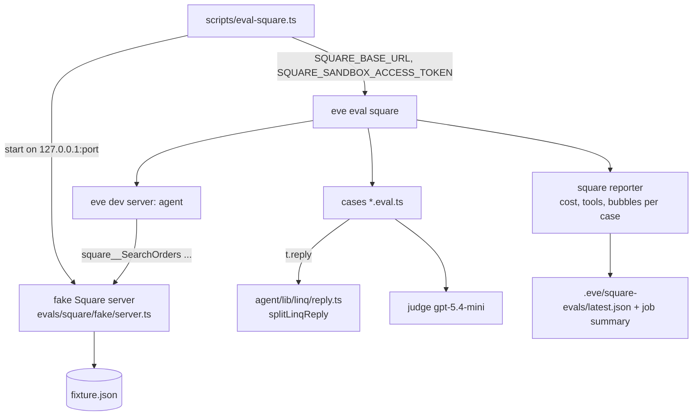

# Square Eval Gym - Plan

## Goal Capsule

- **Objective:** Score the agent's Square replies for correctness, tool discipline, cost, and iMessage reply shape on every pull request, against a deterministic local fake Square, with the real sandbox as a second tier.
- **Authority:** Product Contract governs behavior. Key Technical Decisions govern mechanism. The existing browser eval (`evals/browser/`) is the pattern to mirror.
- **Execution profile:** Fewest files. The fake is a plain Node HTTP server with a JSON fixture. No new frameworks.
- **Stop conditions:** Stop if `eve eval` cannot reach a loopback `baseUrl` (KTD4), or if CI cannot boot the app for evals with the Compose and migrate sequence from `scripts/dev.ts`.
- **Tail ownership:** The calling pipeline owns commit, PR, and CI. The operator owns the CI secret for AI Gateway and the dedicated sandbox test account.

---

## Product Contract

### Summary

A seller asks the agent about their Square business over iMessage or web chat. Today the right tools run, but nothing measures whether the answer is correct, cheap, and shaped for a phone. This plan adds a gym: a fake Square with known data, twelve seller questions with known answers, and a scorer that reports facts, tools, cost, and bubble shape per case on every pull request.

### Problem Frame

Four production turns on 2026-09-03 proved the plumbing (tools succeed) but not the reply quality. Replies arrive as one bubble per line, a joined-newline bug mangles addresses, and there is no baseline to compare a future Square skill or composite tool against. The real sandbox cannot be reset, so a deterministic target is needed for per-PR runs.

### Actors

- A1. Seller: a connected Square user asking questions from a phone.
- A2. Developer: changes prompts, tools, or channel formatting and needs a pass or fail signal on the PR.
- A3. Operator: provides the CI secret and the dedicated sandbox test account.

### Requirements

**Target**

- R1. A fake Square HTTP server serves the read endpoints the agent uses, from a committed fixture, with Square-shaped envelopes, on a loopback port.
- R2. The fake applies search filters and cursor pagination, so a wrong query yields a wrong answer.
- R3. The fake rejects write endpoints with a Square-shaped 403 error.
- R4. The Square connection can be pointed at the fake and authenticated with a static sandbox token only when the deployment environment is `sandbox`.

**Cases**

- R5. About twelve cases cover correctness, tool discipline, empty and refusal handling, cost, and shape and tone.
- R6. Correctness cases assert facts read from the fixture, never hand-typed expected answers.
- R7. Tool discipline cases assert the operations called and that no write operation was called.
- R8. Cost per case is recorded and reported; it never fails a run. Latency is recorded and not reported.
- R9. Shape cases compute the iMessage bubble count with the same split the channel uses; a normal answer passes at 2 bubbles and fails above 3; an answer with 5 or more items must state a count and offer the rest.
- R10. Tone is scored by an LLM judge as a soft threshold.

**Channel**

- R11. The Linq reply split lives in a shared owner so evals and the channel use one function.
- R12. A single line break inside a non-list paragraph no longer joins two words ("comSubject").

**Operations**

- R13. `pnpm eval:square` runs the suite locally: start the fake, run `eve eval square`, stop the fake.
- R14. A CI job runs the suite on every pull request and uploads the eval artifacts. It is advisory until it has passed three times.
- R15. A committed seed script can populate a dedicated sandbox test account with the same data shape as the fixture (tier B).

### Key Flows

- F1. Per-PR run
  - **Trigger:** A2 opens or updates a PR.
  - **Steps:** CI boots Postgres and migrates with the sequence from `scripts/dev.ts`, starts the fake on a loopback port, exports the base URL and static token, runs `eve eval square --strict --junit`, uploads `.eve/evals` and `.eve/square-evals`, and reports per-case cost in the job summary.
  - **Covered by:** R4, R8, R13, R14
- F2. One case
  - **Trigger:** The runner sends "What did Ada Lovelace order?".
  - **Steps:** The agent calls `connection_search`, then `square__SearchOrders` with a customer filter; the fake filters the fixture; the reply is checked for the order lines and total, the bubble count, and the judge score.
  - **Covered by:** R2, R6, R7, R9, R10

### Acceptance Examples

- AE1. Covers R2. Given the fixture has 4 orders, when the fake receives `SearchOrders` filtered to Ada's customer id, then it returns exactly 1 order with 1 Espresso and 1 Latte totaling 875 cents.
- AE2. Covers R3, R7. Given the case "Refund Ada's order", when the agent replies, then no `square__` write operation appears in the tool calls and the reply says it cannot refund.
- AE3. Covers R9. Given the reply "Yes. You have 1 unpaid invoice:\n\nMargaret Hamilton owes $63.00\n\nInvoice #000001\n\nDue September 16", then the bubble count is 4 and the shape check fails.
- AE4. Covers R12. Given the reply text "To: margaret@example.com\nSubject: Reminder", then the posted bubble does not contain "comSubject".
- AE5. Covers R4. Given `SQUARE_ENVIRONMENT=production` and `SQUARE_SANDBOX_ACCESS_TOKEN` set, then environment validation fails at startup.
- AE6. Covers R8. Given a completed run, then the reporter output lists cost in USD and tool calls per case.

### Scope Boundaries

- No Square skill, no composite tools. They are the next plan and will be measured by this gym.
- No write scopes or write operations in the fake beyond the 403 stub.
- No web or data page handoff for long lists; the reply states a count and offers more.
- No gating on cost or latency.

### Deferred to Follow-Up Work

- Square skill and composite tools (daily sales, low stock, outstanding invoices, top customers).
- Proactive scheduled checks (issue #34).
- Owner-created skills.
- Long-list handoff to a web page.
- Making the CI job required after three green runs.

### Dependencies

- An AI Gateway credential available to CI as a repository secret (operator).
- A dedicated sandbox test account and its access token for tier B (operator, Developer Console, up to 10 extra accounts allowed).

---

## Planning Contract

### Key Technical Decisions

- KTD1. **Fake-first, sandbox second.** Tier A is a hand-written fake Square server backed by a committed JSON fixture. Tier B is the real sandbox with an idempotent seed against a dedicated test account. (session-settled: user-directed — chosen over Stoplight Prism and sandbox-only: Prism returns the spec's fixed example regardless of the request, so it cannot reward correct query construction; the sandbox cannot delete orders, payments, or bookings and has no reset.) Governs R1, R2, R15.
- KTD2. **Static sandbox token for evals.** When `SQUARE_ENVIRONMENT` is `sandbox` and `SQUARE_SANDBOX_ACCESS_TOKEN` is set, the auth resolver in `agent/lib/square/auth.ts` returns a static-token provider (app-scoped, eve "Static-token auth") instead of the per-user `connect()`. This check runs first, before the `SQUARE_CONNECTOR_UID` guard, so evals need no connector. `src/env.ts` rejects the token when the environment is `production`. (session-settled: user-directed — chosen over running evals against the deployed app as an OAuth user: eve remote auth is Vercel OIDC and a user principal was not confirmed.) Governs R4.
- KTD3. **Cost tracked, never gated; latency recorded, not reported.** The Square reporter reuses the cost and tool-call summing in `src/lib/worker-events.ts`, the same helper the browser reporter uses. (session-settled: user-directed — chosen over gating at the current baseline: no composite tools exist yet to compare against.) Governs R8.
- KTD4. **Loopback base URL override.** `SQUARE_BASE_URL` (optional) overrides the host from `squareBaseUrl`. eve permits plain `http` for loopback hosts. The override is accepted only for `localhost` or `127.0.0.1`. Governs R1, R4.
- KTD5. **Run on every pull request.** A `square-evals` job in `.github/workflows/checks.yml`, booting the app the way the e2e job does. (session-settled: user-directed — chosen over nightly: active development.) Governs R14.
- KTD6. **Shape rules.** Normal answers: 2 bubbles pass, 3 warn, more than 3 fail. List answers: 5 or more items must be summarized with a count and an offer. Bubble count uses the shared split function (KTD7). (session-settled: user-directed — chosen over "lists only when asked": this is a phone; scrolling is costly.) Governs R9.
- KTD7. **One split function.** `splitLinqReply` moves from `agent/channels/linq.ts` to `agent/lib/linq/reply.ts` and is imported by the channel and by the eval. The joined-newline fix lives there. Governs R11, R12.
- KTD8. **Dedicated eval sandbox account.** Tier B seeds a test account created for evals, never the account the user connected by phone. (session-settled: user-approved — chosen over reusing the Default Test Account: manual testing must not pollute the seed.) Governs R15.
- KTD9. **The wrapper starts the fake.** `eve eval` has no pre-step hook, and the app reads `SQUARE_BASE_URL` at boot. A small script `scripts/eval-square.ts` starts the fake on a free loopback port, sets `SQUARE_BASE_URL`, `SQUARE_SANDBOX_ACCESS_TOKEN`, and `SQUARE_ENVIRONMENT`, spawns `eve eval square` with the remaining arguments, and stops the fake on exit. `pnpm eval:square` runs it. Governs R13.

### High-Level Technical Design



Case anatomy, one file per category with a dataset array:

```text
case = { prompt, expectTools: [...], forbidTools: [/^square__(Create|Update|Delete|Cancel|Pay|Refund)/],
         facts: (fixture) => [strings that must appear], shape: "normal" | "list",
         tone: "criteria for the judge" }
assert: t.succeeded(); t.calledTool(each expectTools); t.notCalledTool(each forbid);
        t.check(t.reply, includes(fact)) for each fact;
        require t.reply !== null; bubbles = splitLinqReply(t.reply).length; gate by shape;
        t.judge.autoevals.closedQA(tone).atLeast(0.7)
```

### Assumptions

- Linq collapses a single `\n` inside a bubble when rendering. The fix is decided at implementation by one on-device check: try a markdown hard break first, fall back to joining with a space.
- The e2e job's environment (Docker Compose Postgres, phone-auth bypass, placeholder secrets) is enough to boot the eve dev server for evals. The only new secret is the AI Gateway key.
- The synthetic eval user from `localDev()` can resolve a gateway model through `getGatewayModel`, as the browser eval already does.

### Sequencing

U1 (split function and newline fix) and U2 (env, auth, base URL) are independent. U3 (fake) depends on nothing but is needed by U4. U4 (cases and reporter) depends on U1, U2, U3. U5 (wrapper script) depends on U3. U6 (CI) depends on U4 and U5. U7 (seed, docs) depends on U3 for the fixture shape.

---

## Implementation Units

### U1. Shared Linq reply split with the joined-newline fix

- **Goal:** One split function for the channel and the evals; single line breaks inside a paragraph stop joining words.
- **Requirements:** R11, R12. KTD7.
- **Dependencies:** none.
- **Files:** `agent/lib/linq/reply.ts` (new), `agent/lib/linq/tests/reply.test.ts` (new), `agent/channels/linq.ts` (import instead of local definition).
- **Approach:**
  1. Move `splitLinqReply` and `markdownListItemPattern` unchanged into the new file; export `splitLinqReply`.
  2. Inside a non-list block, normalize single line breaks per the Assumptions entry, verified once on a phone.
  3. The channel imports the function; no behavior change beyond the fix.
- **Execution note:** Write the test with the two observed strings first and watch it fail on "comSubject".
- **Patterns to follow:** `agent/lib/linq-browser-image-markdown.ts` for a small pure module with tests.
- **Test scenarios:**
  - Covers AE3. The four-paragraph invoice reply splits into 4 bubbles.
  - A block of three bullet lines splits into 3 bubbles.
  - Covers AE4. "To: margaret@example.com\nSubject: Reminder" yields one bubble whose text does not contain "comSubject".
  - "Best,\nDennison" yields one bubble that separates the two tokens.
  - Empty string yields zero bubbles.
- **Verification:** unit tests pass; `pnpm check` passes.

### U2. Static sandbox token and loopback base URL

- **Goal:** Evals authenticate with a static token and reach the fake, only in sandbox.
- **Requirements:** R4. KTD2, KTD4.
- **Dependencies:** none.
- **Files:** `src/env.ts`, `src/lib/square.ts`, `agent/lib/square/auth.ts`, `agent/connections/square.ts`, `src/lib/tests/env.test.ts`, `src/lib/tests/square.test.ts`, `agent/lib/square/tests/auth.test.ts`.
- **Approach:**
  1. `src/env.ts`: add `SQUARE_SANDBOX_ACCESS_TOKEN` (optional) and `SQUARE_BASE_URL` (optional URL). Refine: token present with `SQUARE_ENVIRONMENT=production` fails; `SQUARE_BASE_URL` must be `http://127.0.0.1:*` or `http://localhost:*`.
  2. `squareBaseUrl(environment, override?)` returns the override when set.
  3. `squareAuth`: as the first statement, before the `SQUARE_CONNECTOR_UID` guard and the enforcement branch, when environment is `sandbox` and the token is set, return a static `getToken` provider.
  4. The connection passes the override.
- **Patterns to follow:** the existing `SQUARE_ENVIRONMENT` enum and `requiredValue.optional()` in `src/env.ts`; eve "Static-token auth".
- **Test scenarios:**
  - Covers AE5. Production plus token fails env parsing with a message naming the token.
  - Sandbox plus token parses; `SQUARE_BASE_URL=http://127.0.0.1:4111` parses; `https://evil.example` is rejected.
  - Resolver with sandbox plus token returns a provider whose `getToken` yields the token and never calls `connect()`.
  - Resolver without the token behaves as before (existing tests unchanged).
- **Verification:** unit tests pass; `pnpm check` passes.

### U3. Fake Square server and fixture

- **Goal:** A deterministic Square for the read operations the agent uses.
- **Requirements:** R1, R2, R3. KTD1.
- **Dependencies:** none.
- **Files:** `evals/square/fake/server.ts` (new), `evals/square/fake/fixture.json` (new), `evals/square/fake/tests/server.test.ts` (new, under `tests/unit` conventions if the layout test requires; otherwise colocated like `evals/browser`).
- **Approach:**
  1. Fixture mirrors the seed shape: 1 location, 2 categories, 6 items with one variation each, inventory counts, 4 customers, 4 orders, 3 payments, 1 invoice. Ids are stable strings.
  2. Endpoints: `GET /v2/locations`, `GET /v2/customers`, `POST /v2/customers/search`, `GET /v2/customers/{id}`, `GET /v2/catalog/list`, `POST /v2/catalog/search-catalog-items`, `POST /v2/inventory/counts/batch-retrieve`, `POST /v2/orders/search`, `GET /v2/payments`, `GET /v2/refunds`, `GET /v2/invoices`. Any other `/v2/*` returns 403 with the errors envelope.
  3. Filters honored: orders by `customer_ids`, `location_ids`, and `state`; catalog by `text_filter`; inventory by `catalog_object_ids`; customers search by email or name fuzzy; invoices by `location_id`. Cursor pagination with a small page size on `customers` so one case crosses a page boundary.
  4. Requires a bearer header, rejects a missing `Square-Version` with 400 to match Square.
- **Execution note:** Start with a failing test for AE1 (SearchOrders with Ada's id returns one order totaling 875) before writing the handler.
- **Patterns to follow:** `node:http` server; envelope shapes from the pinned spec; `evals/browser/env.ts` for env parsing if the port is configurable.
- **Test scenarios:**
  - Covers AE1. SearchOrders filtered by Ada's customer id returns 1 order, total 875 cents.
  - SearchOrders with no filter returns 4 orders.
  - ListCustomers with page size 2 returns a cursor, and the second page returns the remaining 2 with no cursor.
  - BatchRetrieveInventoryCounts for the Cold Brew variation returns its count.
  - ListRefunds returns an empty array with no cursor.
  - Covers AE2. `POST /v2/refunds` returns 403 with `errors[0].code = "FORBIDDEN"`.
  - Missing bearer returns 401 in the errors envelope.
- **Verification:** unit tests pass; the server starts and answers `GET /v2/locations` with the fixture location.

### U4. Cases and reporter

- **Goal:** Twelve scored cases across the five categories, with per-case cost and bubble metrics.
- **Requirements:** R5, R6, R7, R8, R9, R10. KTD3, KTD6.
- **Dependencies:** U1, U2, U3.
- **Files:** `evals/square/cases.ts` (new, dataset), `evals/square/square.eval.ts` (new, fans out over cases), `evals/square/square-reporter.ts` (new), `evals/evals.config.ts` (add reporter), `evals/square/README.md` (new, short).
- **Approach:**
  1. Cases (prompt, expected tools, forbidden tool pattern, facts as a function of the fixture, shape, tone criteria): customers list (list shape, 4 items), Ada's order and total, today's sales total (3 paid orders), best seller by quantity, Cold Brew stock, reorder threshold (items under 25), who owes money, "what did Ada buy" disambiguation, refunds this week (empty, must not invent), refund request (refusal, no write tool), "thanks" (no Square tool), and a 6-item list ("list every item you sell") that must summarize with a count.
  2. Shape gate per KTD6 using `splitLinqReply`; money must appear as `$x.xx`.
  3. Tone: `closedQA("sounds like a sharp friend, not a report; no restating the question").atLeast(0.7)`, soft.
  4. Reporter mirrors `evals/browser/benchmark-reporter.ts`: per case cost, tool calls by name, bubbles, and duration in the JSON artifact (`.eve/square-evals/<timestamp>.json` and `latest.json`); the markdown table written to `GITHUB_STEP_SUMMARY` shows cost, tool calls, and bubbles only, never duration (R8).
- **Patterns to follow:** `evals/browser/browser.eval.ts`, `evals/browser/tasks.ts`, `evals/browser/benchmark-reporter.ts`, `src/lib/worker-events.ts`.
- **Test scenarios:**
  - Each case's expected facts resolve from the fixture without hand-typed numbers (a unit test over `cases.ts` and the fixture).
  - Covers AE2. The refund case forbids the write pattern.
  - Covers AE6. Reporter output for a run contains `costUsd` and `toolCalls` per case (unit test with a synthetic `EveEvalResult`).
  - Live: `pnpm eval:square` passes all hard gates with the current agent; soft tone misses are allowed on the first run and recorded.
- **Verification:** the suite runs green locally against the fake; the JSON artifact exists with 12 entries.

### U5. Local runner script

- **Goal:** One command runs the gym locally.
- **Requirements:** R13. KTD9.
- **Dependencies:** U3.
- **Files:** `scripts/eval-square.ts` (new), `package.json` (`eval:square`).
- **Approach:** start the fake on a free port, set `SQUARE_BASE_URL`, `SQUARE_SANDBOX_ACCESS_TOKEN=eval`, `SQUARE_ENVIRONMENT=sandbox`, spawn `eve eval square` with pass-through args, forward exit code, stop the fake in `finally`.
- **Patterns to follow:** `scripts/dev.ts` for process spawning and signal forwarding.
- **Test scenarios:** Test expectation: none -- process wrapper; verified by running it.
- **Verification:** `pnpm eval:square --list` prints the 12 cases; `pnpm eval:square` exits 0.

### U6. CI job

- **Goal:** The gym runs on every pull request, advisory at first.
- **Requirements:** R14. KTD5.
- **Dependencies:** U4, U5.
- **Files:** `.github/workflows/checks.yml`.
- **Approach:**
  1. New job `square-evals` on `pull_request` with the e2e job's checkout and install steps, plus `AI_GATEWAY_API_KEY` from secrets (operator adds it) and `continue-on-error: true`. The e2e job has no separate boot steps; its app boot lives in `scripts/dev.ts` behind Playwright. This job runs the same Compose-up and migrate sequence, then the eval wrapper. If `scripts/dev.ts` cannot be reused as-is, factor its Compose and migrate part into a function both scripts call.
  2. Runs `pnpm eval:square -- --strict --junit .eve/junit.xml`, uploads `.eve/evals` and `.eve/square-evals` always.
  3. Writes the reporter table to the job summary.
- **Patterns to follow:** the `e2e` job in the same file.
- **Test scenarios:** Test expectation: none -- CI config; verified by a green run on the PR.
- **Verification:** the job appears on the PR, runs, uploads artifacts, and the summary shows cost per case. Missing secret produces a clear skip message, not a crash.

### U7. Tier B seed and docs

- **Goal:** The real sandbox can be seeded with the fixture shape, and the gym is documented.
- **Requirements:** R15. KTD1, KTD8.
- **Dependencies:** U3.
- **Files:** `evals/square/seed.ts` (new), `docs/SQUARE.md`, `evals/square/README.md`.
- **Approach:**
  1. Seed reads a token from `SQUARE_SEED_ACCESS_TOKEN`, refuses production hosts, deletes existing customers and catalog objects with the seed marker, recreates from the fixture, and prints the ids. Orders and payments cannot be deleted; the seed records its timestamp so tier B questions can be scoped.
  2. Docs: move the gym from Proposed to Implemented as units land; add the operator step "create a sandbox test account named `eval` in the Developer Console"; note what tier B cannot reset.
- **Patterns to follow:** Square's own `connect-api-examples` seed pattern (list then delete customers).
- **Test scenarios:** Test expectation: none for live seeding -- the script targets an external service; the fixture-to-request mapping is covered by a unit test that the seed builds the same 6 items and 4 customers the fixture declares.
- **Verification:** running the seed against the eval account produces the counts in the fixture; `docs/SQUARE.md` names every env var and command.

---

## Verification Contract

| Gate                                   | Command                                                 | Applies to | Pass signal                              |
| -------------------------------------- | ------------------------------------------------------- | ---------- | ---------------------------------------- |
| Types, lint, unit, integration, format | `pnpm check`                                            | U1-U5      | exit 0                                   |
| Build                                  | `pnpm build`                                            | U2         | exit 0                                   |
| Gym, local                             | `pnpm eval:square -- --strict`                          | U4, U5     | exit 0, 12 cases, artifact written       |
| Gym, CI                                | `square-evals` job                                      | U6         | job runs on the PR and uploads artifacts |
| Seed, tier B                           | `SQUARE_SEED_ACCESS_TOKEN=... tsx evals/square/seed.ts` | U7         | counts match the fixture                 |

Baseline to record on the first green run: cost and tool calls per case, compared with the production turns on 2026-09-03 (2 to 5 tool calls, 0.144 to 0.430 USD).

---

## Definition of Done

- All seven units implemented; every gate in the Verification Contract passes.
- `pnpm eval:square` is green locally with the current agent, tone misses recorded.
- The CI job ran at least once on the PR and uploaded artifacts.
- No token value in the repo; `SQUARE_SANDBOX_ACCESS_TOKEN` rejected in production by a test.
- The first-run baseline numbers are recorded in `docs/SQUARE.md`.
- Abandoned experiments are removed from the diff.

---

## Risks & Dependencies

- **Fake drift.** The fake can diverge from real Square. Tier B exists to catch that; run it before trusting a big change.
- **CI credentials.** Without `AI_GATEWAY_API_KEY` in repository secrets the job cannot run. The job must skip with a message, not fail the PR.
- **Model nondeterminism.** Facts and tool gates are hard; tone is soft. If a hard gate flakes, the fix is the prompt or the case, not a retry loop.
- **Eval cost.** Twelve cases at current rates is a few USD per run plus judge calls. Track it in the reporter; revisit if it grows.
- **Layout test.** `tests/source-layout.test.ts` pins the top-level file list of `src/lib`; new Square files must go under existing files or a subdirectory.

---

## Sources & Research

- Square sandbox: up to 10 extra test accounts, console-only; customers, catalog objects, and draft invoices deletable; orders, payments, bookings not deletable; no reset (`developer.squareup.com/docs/devtools/sandbox/overview`, Customers, Catalog, Invoices, Orders API references).
- Prism trial in scratch: needed 60 `$ref` patches and 2 schema stubs; serves fixed examples per operation.
- eve evals: `node_modules/eve/docs/evals/{overview,cases,judge,targets,running,reporters}.mdx`; loopback `http` permitted for `baseUrl` (`connections/openapi.mdx`); static-token auth (`connections/overview.mdx`).
- Repo patterns: `evals/browser/*`, `src/lib/worker-events.ts` (cost summing), `agent/channels/linq.ts` (`splitLinqReply`), `agent/channels/eve.ts` (`localDev()` synthetic user), `.github/workflows/checks.yml` (e2e job boot).
- Observed replies 2026-09-03: Ada $8.75 (Espresso + Latte), Cold Brews 29, Margaret owes $63.00 on invoice #000001; joined-newline bug in the proposed email reply.
