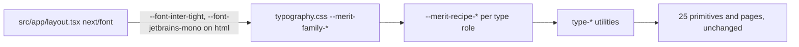

# Jory restyle of the OpenInstinct design system - Plan

## Goal Capsule

- **Objective:** Make the OpenInstinct product UI look and feel like Jory by changing the token and type layers and a small set of primitives, with no call-site rewrites.
- **Authority:** Product Contract governs behavior. Key Technical Decisions govern mechanism. `docs/DESIGN_SYSTEM.md` and `docs/design/catalog-openinstinct.md` section A are the maps of what changes.
- **Execution profile:** Fewest files. Tokens first, then type, then four primitive files, then the bypass fixes, then docs. No new dependencies.
- **Stop conditions:** Stop if `next/font/google` cannot fetch at build time in CI (KTD2 fallback then applies).
- **Tail ownership:** The calling pipeline owns commit, PR, CI, and merge.

---

## Product Contract

### Summary

OpenInstinct today is a white, neutral gray, iOS-blue shadcn app set in the Vault fonts. Jory is a cream and navy product set in Inter Tight with pill badges, soft tints, and lavender chat bubbles. This plan moves OpenInstinct to the Jory look by retokening the design system: every primitive already reads color, radius, and type from tokens, so the visible change lands with few component edits.

### Problem Frame

`docs/JORY_DESIGN_MERGE.md` section 2 lists the differences: background, text, primary action, accent hue, status tones, font, weights, radius, shadows, and chat bubbles. `docs/design/catalog-openinstinct.md` section A lists what a restyle touches per component and what stays structural. Section C lists 24 places where product code bypasses the tokens with raw Tailwind classes; those must move onto tokens or the restyle leaves them behind.

### Actors

- A1. User of the product UI: sees the new look on sign-in, workspace, chat, tasks, vault, personal info, and admin routes.
- A2. Developer: changes UI later and needs the token layer and `docs/DESIGN_SYSTEM.md` to agree.

### Requirements

**Tokens**

- R1. The page background is cream (`#FAF7F0`); cards, popovers, and dialogs are white; text is navy ink (`#071B36`); muted text is `#5A6A82`; borders and inputs are `#E6E6E6`.
- R2. The primary action is navy (`#061A33`) with white text; hover is `#0F2A4D`. The focus ring and link color are indigo (`#4F46E5`). The iOS blue is gone.
- R3. The four status tones use Jory values: success `#22C55E` with subtle `#E9F8E8`; warning `#D4A72C` with subtle `#FFF1CF`; information `#4F46E5` with subtle `#EDE8FF`; destructive `#B3261E` with subtle `#FFE7DF`. Each tone keeps its `-border` token at reduced strength.
- R4. The radius base is 12px. Cards resolve to 16px. Badges are pills.
- R5. Two shadow tokens exist: card `0 2px 10px rgba(0,0,0,.04)` and card-hover `0 6px 20px rgba(0,0,0,.06)`.
- R6. Nine categorical activity tokens (`--activity-1` to `--activity-9`) exist for the browser activity legend.
- R7. Every token above is written in `foundation.css` as OKLCH with the source hex in a comment. `globals.css` holds no color overrides.

**Type**

- R8. The text and display families are Inter Tight; the mono family is JetBrains Mono. Both load through `next/font` and expose CSS variables.
- R9. Weights are body 400, ui 500, emphasis 600. Every `type-*` utility keeps its name and size, so no call site changes.
- R10. The Vault font files and their `@font-face` blocks are removed, and the third-party notice for them is removed.

**Primitives**

- R11. `Badge` is a pill with tone variants that use the subtle and strong tokens (default, secondary, success, warning, information, destructive, outline, ghost, link).
- R12. `Button` default uses the primary token with the hover token; `Card` uses the card shadow token and the 16px radius; `Alert` tones use the subtle and border pairs.
- R13. Chat messages use `bubble-user` (`#F1F5F9`) for the user side and `bubble-assistant` (`#E0E7FF`, Jory's `bubble-jory`) for the assistant side, radius 18px.

**Bypasses**

- R14. The raw `text-sm`, `text-xs`, and `font-medium` classes in `sidebar.tsx`, `question.tsx`, and `conversation.tsx` are replaced with `type-*` utilities.
- R15. `activity-duration-breakdown.tsx` reads its nine colors from the activity tokens, not from raw palette classes.

**Docs**

- R16. `docs/DESIGN_SYSTEM.md` records every new value and removes the gaps this plan fixes. `docs/JORY_DESIGN_MERGE.md` section 3.1 records D1 to D6 as decided.

### Key Flows

- F1. A user opens `/sign-in`, signs in, and lands on `/`. Every screen shows the cream page, white cards, navy buttons, and Inter Tight text.
- F2. A user opens a chat. User messages sit in gray bubbles on the right; assistant messages sit in lavender bubbles on the left.
- F3. A developer adds a `Badge` with a tone variant and gets a pill with the matching soft tint without writing a color class.

### Acceptance Examples

- AE1. On `/`, the body background computes to `#FAF7F0` and the primary button on the workspace page computes to `#061A33` with white text.
- AE2. On `/`, the Connected badge renders as a pill (full radius) with the soft green background `#E9F8E8`.
- AE3. On `/chat/[sessionId]`, an assistant message container has background `#E0E7FF` and a user message container has `#F1F5F9`, both with 18px radius.
- AE4. `document.fonts` reports Inter Tight loaded, and no request for `/fonts/vault-*.woff2` occurs.
- AE5. A grep for `text-sm`, `text-xs`, `font-medium`, and `bg-[a-z]+-[0-9]+` in `src/components` and `src/app` returns nothing.

### Scope Boundaries

- Marketing pages, the mascot, and the wordmark are not added.
- Dark mode is not wired. The `.dark` block in `foundation.css` stays as it is.
- The headless library (`@base-ui/react`) and `components.json` do not change.
- No file under `agent/` changes, so the Square evals do not run.
- The Pencil canvas `docs/design/design-system.pen` is not updated in this plan.

### Deferred to Follow-Up Work

- Update the Pencil canvas sections 04 to 07 to the new tokens once the code has landed.
- Decide whether the `.dark` block gets Jory values or is deleted (D4 kept it defined and unreachable).
- Replace `chart-1` to `chart-5` with Jory values if a chart ever ships.

### Dependencies

- Network access at build time for `next/font/google` (Vercel builds and the CI e2e job both have it; see Risks).

---

## Planning Contract

### Key Technical Decisions

- KTD1. **Retoken, do not rewrite.** All color, radius, and type changes land in `src/app/styles/brand/foundation.css` and `typography.css`; primitives change only where a class is not token-driven (Badge shape, Card shadow, message bubbles). (session-settled: user-directed — chosen over rebuilding components or copying Jory's inline-styled components: the primitives read every color and type role from tokens, and `AGENTS.md` requires building from `src/components/ui`.)
- KTD2. **Fonts through `next/font/google`.** Inter Tight (400 to 800) and JetBrains Mono load in `src/app/layout.tsx` and expose `--font-inter-tight` and `--font-jetbrains-mono`; `typography.css` points the `--merit-family-*` tokens at those variables with system fallbacks. Fallback if the fetch fails in CI: vendor the two variable woff2 files under `public/fonts` and load them with `next/font/local`; the token names stay the same.
- KTD3. **Keep the `--merit-*` token names.** Renaming them would touch every `type-*` recipe for no visible gain. The names are an upstream artifact and are documented as such.
- KTD4. **Keep `@base-ui/react` and `components.json`.** (session-settled: user-directed — chosen over moving to `radix-ui` to match Jory's stock shadcn install: no visual effect, and `AGENTS.md` says to preserve the primitive base.)
- KTD5. **No dark mode wiring.** The `.dark` block stays defined and unreachable. (session-settled: user-directed — chosen over adding a theme provider and toggle: neither product ships dark mode and it is out of the Jory look.)
- KTD6. **Radius scale.** `--radius` becomes 12px. The scale factors change so `--radius-lg` is 12px (inputs, buttons) and `--radius-xl` is 16px (cards, dialogs). `Card` drops its literal `rounded-xl` only if it does not already resolve through the token; the catalog shows `rounded-xl` on the card root, which resolves through `--radius-xl`, so no class change is needed there.
- KTD7. **Activity legend tokens.** Nine `--activity-N` colors are defined once in `foundation.css` and mapped in the Tailwind `@theme inline` block, so the legend uses `bg-activity-1` style classes. Values are the sRGB hex of the Tailwind classes the file uses today (violet-500, cyan-500, blue-500, fuchsia-500, emerald-500, amber-500, slate-400, orange-400, zinc-400) so the legend does not change color in this plan; it only stops bypassing tokens.

Fixed inputs for this plan, stated to the user and not yet confirmed by the user (D1, D2, D3, D6 in `docs/JORY_DESIGN_MERGE.md` section 3.1): the token-file palette, Inter Tight, cream page with white cards, and navy primary with indigo ring and links. They are inputs, not settled decisions.

### High-Level Technical Design

Token table for `foundation.css` `:root` (OKLCH rounded to three places; the source hex goes in a comment on each line):

| Semantic token                              | Jory source                                            | Hex       | OKLCH                                                                                                                                                                                                                                                                                                                                                           |
| ------------------------------------------- | ------------------------------------------------------ | --------- | --------------------------------------------------------------------------------------------------------------------------------------------------------------------------------------------------------------------------------------------------------------------------------------------------------------------------------------------------------------- |
| `background`                                | bg                                                     | `#FAF7F0` | `oklch(0.977 0.010 87.5)`                                                                                                                                                                                                                                                                                                                                       |
| `foreground`                                | ink                                                    | `#071B36` | `oklch(0.223 0.059 256.6)`                                                                                                                                                                                                                                                                                                                                      |
| `card`, `popover`                           | white (Jory cards)                                     | `#FFFFFF` | `oklch(1 0 0)`                                                                                                                                                                                                                                                                                                                                                  |
| `card-foreground`, `popover-foreground`     | ink                                                    | `#071B36` | as foreground                                                                                                                                                                                                                                                                                                                                                   |
| `primary`                                   | cta                                                    | `#061A33` | `oklch(0.217 0.056 255.1)`                                                                                                                                                                                                                                                                                                                                      |
| `primary-foreground`                        | white                                                  | `#FFFFFF` | `oklch(1 0 0)`                                                                                                                                                                                                                                                                                                                                                  |
| `secondary`, `muted`, `accent`              | Jory `muted` surface (visible on both cream and white) | `#E6E6E6` | `oklch(0.925 0 0)`                                                                                                                                                                                                                                                                                                                                              |
| `secondary-foreground`, `accent-foreground` | ink-2                                                  | `#16233B` | `oklch(0.257 0.049 261.9)`                                                                                                                                                                                                                                                                                                                                      |
| `muted-foreground`                          | muted-ink                                              | `#5A6A82` | `oklch(0.520 0.043 258.4)`                                                                                                                                                                                                                                                                                                                                      |
| `border`, `input`                           | muted                                                  | `#E6E6E6` | `oklch(0.925 0 0)`                                                                                                                                                                                                                                                                                                                                              |
| `ring`                                      | accent-indigo                                          | `#4F46E5` | `oklch(0.511 0.230 277.0)`                                                                                                                                                                                                                                                                                                                                      |
| `success`                                   | accent-green                                           | `#22C55E` | `oklch(0.723 0.192 149.6)`                                                                                                                                                                                                                                                                                                                                      |
| `success-subtle`                            | soft-green                                             | `#E9F8E8` | `oklch(0.964 0.026 143.6)`                                                                                                                                                                                                                                                                                                                                      |
| `warning`                                   | mustard                                                | `#D4A72C` | `oklch(0.750 0.141 87.1)`                                                                                                                                                                                                                                                                                                                                       |
| `warning-subtle`                            | soft-yellow                                            | `#FFF1CF` | `oklch(0.961 0.047 88.3)`                                                                                                                                                                                                                                                                                                                                       |
| `information`                               | accent-indigo                                          | `#4F46E5` | `oklch(0.511 0.230 277.0)`                                                                                                                                                                                                                                                                                                                                      |
| `information-subtle`                        | soft-purple                                            | `#EDE8FF` | `oklch(0.942 0.031 295.8)`                                                                                                                                                                                                                                                                                                                                      |
| `destructive`                               | Jory error red                                         | `#B3261E` | `oklch(0.501 0.178 28.7)`                                                                                                                                                                                                                                                                                                                                       |
| `destructive-subtle`                        | soft-red                                               | `#FFE7DF` | `oklch(0.945 0.029 39.3)`                                                                                                                                                                                                                                                                                                                                       |
| `*-border` (4 tones)                        | strong at 32%                                          |           | strong OKLCH `/ 32%`                                                                                                                                                                                                                                                                                                                                            |
| `sidebar`                                   | bg                                                     | `#FAF7F0` | as background                                                                                                                                                                                                                                                                                                                                                   |
| `sidebar-accent`                            | white                                                  | `#FFFFFF` | `oklch(1 0 0)`                                                                                                                                                                                                                                                                                                                                                  |
| `sidebar-border`                            | muted                                                  | `#E6E6E6` | as border                                                                                                                                                                                                                                                                                                                                                       |
| `bubble-user` (new)                         | bubble-user                                            | `#F1F5F9` | `oklch(0.968 0.007 247.9)`                                                                                                                                                                                                                                                                                                                                      |
| `bubble-assistant` (new)                    | bubble-jory                                            | `#E0E7FF` | `oklch(0.930 0.033 272.8)`                                                                                                                                                                                                                                                                                                                                      |
| `primary-hover` (new)                       | cta-hover                                              | `#0F2A4D` | `oklch(0.285 0.072 256.1)`                                                                                                                                                                                                                                                                                                                                      |
| `activity-1` to `-9` (new)                  | Tailwind v4 `theme.css` values the legend uses today   |           | violet-500 `oklch(60.6% 0.25 292.717)`, cyan-500 `oklch(71.5% 0.143 215.221)`, blue-500 `oklch(62.3% 0.214 259.815)`, fuchsia-500 `oklch(66.7% 0.295 322.15)`, emerald-500 `oklch(69.6% 0.17 162.48)`, amber-500 `oklch(76.9% 0.188 70.08)`, slate-400 `oklch(70.4% 0.04 256.788)`, orange-400 `oklch(75% 0.183 55.934)`, zinc-400 `oklch(70.5% 0.015 286.067)` |

Text on the strong success and warning tones must stay readable: the `Badge` and `Alert` tone variants put ink text on the subtle tint, never white text on the strong color. The strong color is used for borders, icons, and the destructive button text only.

The radius scale, with base 12px: xs 6, sm 8, md 10, lg 12, xl 16, 2xl 20, 3xl 24, 4xl 28.

Font flow:

### Assumptions

- The user will accept the fixed inputs D1, D2, D3, and D6; the intent validator confirms them before the PR is opened.
- Verified 2026-09-03: `src/proxy.ts` excludes paths prefixed with `fonts` by name, not by file existence, so `src/auth/tests/proxy.test.ts` keeps passing after the woff2 files are deleted. The fixture string can stay as it is.
- Jory's white cards on a cream page carry over to OpenInstinct's `Card`, `Dialog`, and `Popover`; the sidebar takes the cream page color with white active items.

### Sequencing

U1 and U2 are independent. U3 and U4 depend on U2. U5 depends on U1 to U4. U6 depends on all.

---

## Implementation Units

### U1. Inter Tight and JetBrains Mono through next/font

**Goal:** Load the Jory fonts and repoint the type tokens without touching any `type-*` name or size.

**Requirements:** R8, R9, R10. KTD2, KTD3.

**Dependencies:** none.

**Files:**

- `src/app/layout.tsx` (modify: load both fonts, put their variable classes on `<html>`)
- `src/app/styles/brand/typography.css` (modify: remove the three `@font-face` blocks; point `--merit-family-text` and `--merit-family-display` at `var(--font-inter-tight)` with `system-ui` fallbacks and `--merit-family-mono` at `var(--font-jetbrains-mono)` with `ui-monospace` fallbacks; set `--merit-weight-body` 400, `-ui` 500, `-signal` 400, `-emphasis` 600, `-mono` 400; update the header comment)
- `public/fonts/` (delete the three woff2 files and `OFL.txt`)
- `THIRD_PARTY_NOTICES.md` (modify: remove the `public/fonts` attribution)

**Approach:**

1. Add the two `next/font/google` loaders with `display: "swap"` and the CSS variable names in KTD2.
2. Repoint the family tokens and weights in `typography.css`; leave every `--merit-size-*`, `--merit-leading-*`, and `--merit-recipe-*` line as it is.
3. Remove the font files and the notice text.
4. Build once; if the font fetch fails, apply the KTD2 fallback.

**Execution note:** This is font and config work; prove it by build and a runtime check of `document.fonts`, not unit coverage.

**Patterns to follow:** Jory's `apps/web/src/app/layout.tsx` (Inter Tight through `next/font/google` with a CSS variable).

**Test scenarios:**

- `Test expectation: none -- font loading and token repointing; proved by build and AE4.`

**Verification:** `pnpm build` passes. On `/sign-in` the heading renders in Inter Tight and no network request for `/fonts/` occurs (AE4). The `type-page-title` computed weight is 500 and `type-body` is 400.

### U2. Jory palette, radius, shadow, and activity tokens

**Goal:** Put the whole Jory palette into the semantic token layer and remove the iOS blue override.

**Requirements:** R1, R2, R3, R4, R5, R6, R7. KTD1, KTD6, KTD7.

**Dependencies:** none.

**Files:**

- `src/app/styles/brand/foundation.css` (modify: every `:root` color per the token table; radius base and factors per KTD6; add `--shadow-card`, `--shadow-card-hover`, `--bubble-user`, `--bubble-assistant`, `--primary-hover`, `--radius-bubble` (1.125rem, 18px), `--activity-1` to `--activity-9`; map the new tokens in `@theme inline` as `--color-*`, `--shadow-*`, and `--radius-*` so Tailwind classes exist)
- `src/app/globals.css` (modify: delete the `:root` and `.dark` primary and ring overrides)

**Approach:**

1. Replace the light values with the OKLCH values from the token table and keep the source hex in a trailing comment on each line.
2. Leave the `.dark` block untouched (KTD5).
3. Set `--radius: 0.75rem` and the factors so the eight names resolve to 6, 8, 10, 12, 16, 20, 24, 28px.
4. Register the new tokens in `@theme inline`.
5. Delete the overrides in `globals.css`.

**Patterns to follow:** the existing three-token status pattern (`success`, `success-border`, `success-subtle`) in `foundation.css`.

**Test scenarios:**

- `Test expectation: none -- pure token values; proved by AE1 and the primitive checks in U3.`

**Verification:** `pnpm check` passes. On `/`, the body background computes to `#FAF7F0` and the default button to `#061A33` (AE1). `grep -n "007aff\|0a84ff" src` returns nothing.

### U3. Badge pill, Button hover, Card shadow, Alert tones, chat bubbles

**Goal:** Change the few primitives whose look is not fully token-driven.

**Requirements:** R11, R12, R13. KTD1, KTD6.

**Dependencies:** U2.

**Files:**

- `src/components/ui/badge.tsx` (modify: `rounded-full`; tone variants use `bg-<tone>-subtle text-foreground border-<tone>-border`; `default` keeps the primary fill)
- `src/components/ui/button.tsx` (modify: `default` hover uses `bg-primary-hover` instead of `bg-primary/80`; `link` uses `text-ring` for the indigo link color)
- `src/components/ui/badge.tsx` `link` variant and `src/components/ui/field.tsx` anchor hover (modify: `text-primary` becomes `text-ring`, the same indigo link rule as Button)
- `src/components/ui/card.tsx` (modify: add `shadow-card`; keep `rounded-xl`, which now resolves to 16px)
- `src/components/ui/alert.tsx` (verify the tone variants already pair `-subtle` and `-border`; change only if a variant uses the strong color as a fill)
- `src/components/ai-elements/message.tsx` (modify: the user container uses `bg-bubble-user`, the assistant container gets `bg-bubble-assistant px-4 py-3`, both `rounded-bubble`, the new 18px radius token from U2)
- `src/components/ui/tests/badge.test.tsx` (create)

**Approach:**

1. Badge: replace the radius class and the tone class strings. Keep every variant name so the 12 call sites and the dynamic `variant={...}` sites keep working.
2. Button: two class edits, no variant or size changes.
3. Card: one class added.
4. Message: the assistant side gains a bubble; today it has none. Keep `is-user` and `is-assistant` group classes since `conversation.tsx` and tests may rely on them.

**Patterns to follow:** `badge.tsx` cva map; Jory `status-pill.tsx` (soft tint with ink text, solid fill reserved for the highest urgency).

**Test scenarios:**

- Happy path: rendering `Badge` with each of the nine variants sets `data-variant` to that name and the class list contains `rounded-full`.
- Happy path: `Badge` variant `success` class list contains `bg-success-subtle` and does not contain `text-primary-foreground`.
- Edge: `Badge` with no variant renders the `default` variant.
- Integration: `Message` with `from="assistant"` renders a container whose class list contains `bg-bubble-assistant`; `from="user"` contains `bg-bubble-user`. Covers AE3.

**Verification:** The badge test passes. On `/`, the Connected badge is a pill with `#E9F8E8` (AE2). On a chat with messages, bubbles match AE3.

### U4. Replace the 24 token bypasses

**Goal:** Every product component reads type and color from tokens.

**Requirements:** R14, R15. KTD7.

**Dependencies:** U2.

**Files:**

- `src/components/ui/sidebar.tsx` (modify lines near 417, 463, 490 to 503, 606, 696: `text-xs font-medium` becomes `type-micro`; `text-sm` becomes `type-label`; the size variants `sm` use `type-caption`)
- `src/components/ai-elements/question.tsx` (modify lines 193 and 203: `type-label` and `type-supporting-body text-muted-foreground`)
- `src/components/ai-elements/conversation.tsx` (modify lines 186 and 188: same two roles)
- `src/components/browser/activity-duration-breakdown.tsx` (modify: the nine `className` values become `bg-activity-1` to `bg-activity-9` in the current order)
- `src/components/ai-elements/shimmer.tsx` (leave; the `#0000` gradient stop is transparent, not a color choice)
- `src/app/icon.tsx` (leave; favicon generator, not product UI)
- `src/components/browser/tests/activity-duration-breakdown.test.tsx` (create)

**Approach:** One-for-one class swaps. Do not change layout classes on the same lines.

**Patterns to follow:** `src/app/(authenticated)/_components/authenticated-navigation.tsx` already uses `type-micro` for a sidebar group label and `type-label` for the mobile header.

**Test scenarios:**

- Happy path: rendering the breakdown with one entry per activity kind yields nine swatches whose class lists contain `bg-activity-1` to `bg-activity-9` and no `bg-<palette>-<number>` class.
- Edge: rendering with an unknown activity kind falls back to the `other` presentation.

**Verification:** AE5 grep returns nothing. The sidebar labels, question form, and empty conversation state look the same size as before at 14px and 11px.

### U5. Documentation

**Goal:** `docs/DESIGN_SYSTEM.md` describes the new system and the merge doc records the decisions.

**Requirements:** R16.

**Dependencies:** U1 to U4.

**Files:**

- `docs/DESIGN_SYSTEM.md` (modify: sections 2, 3.1, 3.2 weights, 3.3 table with the new hex and OKLCH, 3.4 radius, new 3.5a shadow and activity tokens, 4 Badge and Button notes, 8 gaps: remove items 1, 3 if fixed, 4, 8; keep the dark mode note; add a "Restyle 2026-09-03" note at the top)
- `docs/JORY_DESIGN_MERGE.md` (modify section 3.1: D1 to D6 rows become "Decided" with the chosen value; section 3.2 steps 1 to 3 marked done, 4 to 6 still open)
- `docs/design/README.md` (modify: one line that the canvas sections 04 to 07 predate the restyle)

**Approach:** Replace values in place; do not add narrative. Keep every number identical to the code.

**Test scenarios:**

- `Test expectation: none -- documentation.`

**Verification:** `pnpm exec oxfmt --check docs` passes. Every hex in the doc's section 3.3 appears in `foundation.css` comments.

### U6. Visual smoke on the five routes

**Goal:** See the new look on every route Actor A1 names before the PR opens.

**Requirements:** F1, F2, AE1 to AE5.

**Dependencies:** U1 to U5.

**Files:** none in the repo; screenshots go to the session scratchpad and the PR body.

**Approach:**

1. Start the app with `scripts/dev.ts` (Playwright's web server path) and sign in through the local phone-auth bypass with the env in `playwright.config.ts`.
2. Run the `ux-paths`, `ux-walker`, and `ux-flow` skills on `/sign-in`, `/`, `/chat`, `/tasks`, `/vault`, `/personal-info`, and `/admin`.
3. Check computed styles for AE1 to AE4 in the browser and run the AE5 grep.

**Execution note:** Smoke first; the unit tests in U3 and U4 are the durable regression.

**Test scenarios:**

- `Test expectation: none -- manual and skill-driven smoke; the durable tests live in U3 and U4.`

**Verification:** Screenshots of the seven routes show cream background, navy primary buttons, pill badges, Inter Tight text, and lavender assistant bubbles. `pnpm test:e2e` passes.

---

## Verification Contract

- `pnpm check` passes (lint, types, unit and integration tests, format, knip, boundaries).
- `pnpm build` passes with the fonts fetched.
- `pnpm test:e2e` passes.
- AE1 to AE5 hold on the running app.
- The three UX skills ran on the seven routes and their screenshots are attached to the PR.
- Text on every surface keeps at least 4.5:1 contrast; the muted text `#5A6A82` on cream and on white is checked in the browser.

## Definition of Done

- All 16 requirements are implemented and the Verification Contract holds.
- `docs/DESIGN_SYSTEM.md` matches the code value for value.
- The PR body lists the fixed inputs D1, D2, D3, D6 as the decisions the restyle assumed.
- Merged to `main` on `dennisonbertram/fork-OpenInstinct` with the branch deleted.

---

## Risks & Dependencies

- **Font fetch at build.** `next/font/google` downloads at build time. Vercel and the CI e2e job have network access (`.github/workflows/checks.yml` sets no restriction). The checks job does not run `pnpm build`, so a fetch failure would surface on Vercel first. Mitigation: KTD2 fallback to `next/font/local`.
- **Contrast on strong tones.** `#22C55E` and `#D4A72C` fail contrast with white text. The plan never puts white text on them (see High-Level Technical Design).
- **Dynamic badge variants.** Six call sites pass `variant={...}` from status maps. Keeping every variant name avoids a runtime mismatch.
- **Secondary surfaces on a cream page.** `secondary`, `muted`, and `accent` use Jory's `muted` (`#E6E6E6`), not the cream, so secondary buttons and hover states stay visible on the cream page and on white cards. On white cards `bg-muted/50` reads as a light gray tint. U6 checks the workspace page, the sidebar hover state, and the chat composer.

## Sources & Research

- `docs/DESIGN_SYSTEM.md` sections 3 and 8 (current tokens and gaps).
- `docs/JORY_DESIGN_MERGE.md` sections 1.2, 2, 3 (Jory tokens and decisions).
- `docs/design/catalog-openinstinct.md` sections A and C (restyle checklist and bypass list).
- `/Users/dennison/develop/jory/apps/web/src/lib/design-tokens.ts` and `apps/web/src/app/layout.tsx` (Jory values and font loading).
- Repo verification on 2026-09-03: no test asserts class names or fonts; `next/font` is unused today; `knip.config.ts` does not track `public/`; `next.config.ts` is empty; `playwright.config.ts` boots through `scripts/dev.ts` with the phone-auth env.
