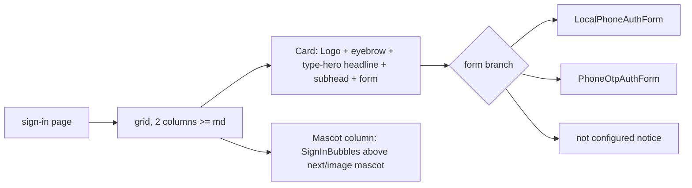

# Jory character on the sign-in page - Plan

## Goal Capsule

- **Objective:** Give `/sign-in` the Jory homepage's character (clay mascot, heavy tight headline, chat-bubble motif, pill button) on the shipped Jory token layer, without touching the auth flow.
- **Authority:** Product Contract governs behavior. Key Technical Decisions govern mechanism. `docs/DESIGN_SYSTEM.md` governs tokens and type roles.
- **Execution profile:** Four files of product code, one asset, two type roles, two tests, one doc update. No new dependencies.
- **Stop conditions:** Stop if the mascot cannot be served to a signed-out visitor after the proxy matcher change (KTD2), or if the e2e sign-in helper stops finding the phone field or the Continue button.
- **Tail ownership:** The calling pipeline owns commit, PR, CI, and merge.

---

## Product Contract

### Summary

The sign-in page is a bare centered form on the cream page. Jory's homepage is a heavy headline, a 3D clay mascot, and a chat-bubble pair. This plan puts that character on the sign-in page: a white card with an eyebrow, a hero headline, and the existing form on the left; the mascot with a bubble pair on the right. The phone flow, labels, and button text do not change.

### Problem Frame

`src/app/sign-in/page.tsx` renders `h1.type-page-title` "Sign In", a subhead, and one of three forms. The Jory hero (`docs/design/catalog-jory-marketing.md` section 2) is a 58px weight 700 headline with -0.02em tracking, the desk mascot render, and a chat-bubble pair. The design system has no hero or eyebrow type role yet (`docs/JORY_DESIGN_MERGE.md` section 3.2 step 2 named both as missing). The auth proxy in `src/proxy.ts` redirects every path except `_next/static`, `_next/image`, `fonts`, and `favicon.ico` to `/sign-in`, so a new static asset folder is unreachable for a signed-out visitor until the matcher excludes it.

### Actors

- A1. Signed-out visitor: sees the new page on desktop and phone, signs in the same way as before.
- A2. Playwright e2e setup: signs in by the "Phone number" label and the "Continue" button (`tests/e2e/helpers.ts`).

### Requirements

- R1. The mascot render `public/brand/jory-avatar-desk.webp` is served to a signed-out visitor and rendered through `next/image` with alt text "Jory, the OpenInstinct assistant, at a desk".
- R2. Two type roles exist: `type-hero` (3.5rem, weight 700, tracking -0.02em, line height 1.02; 2.375rem below 40rem width) and `type-eyebrow` (0.8125rem, weight 600, tracking 0.14em, uppercase, line height 1.35). Both are also declared with `@utility`.
- R3. At widths of 48rem and above, the page is two columns: a white card (`bg-card rounded-xl shadow-card p-8 max-w-md`) with the `Logo`, the eyebrow "OpenInstinct", the headline "Sign in." in `type-hero`, the subhead, and the form; beside it the mascot at about 420px wide, bottom-aligned, with a bubble card above it.
- R4. Below 48rem, the mascot sits above the card at about 240px wide, the bubble card is hidden, and everything is stacked and centered.
- R5. The bubble card has a user bubble (`bg-bubble-user rounded-bubble`, "Can you check the Square inventory for low-stock items?") and an assistant bubble (`bg-bubble-assistant rounded-bubble`, "On it. I will pull the catalog and flag anything under threshold.").
- R6. The subhead reads "Enter your phone number to sign in." for the local bypass and "Enter your phone number and we will text you a code." for the OTP flow. The "iMessage sign-in is not configured" branch and the `callbackUrl` handling are unchanged.
- R7. The primary submit button of each sign-in form is a pill (`rounded-full`) on this page only, size `lg`, full width. Button text is unchanged: "Continue" in `local-form.tsx`, "Send code" and "Verify code" in `otp-form.tsx`. The field label stays "Phone Number".
- R8. `docs/DESIGN_SYSTEM.md` section 3.2 lists the two roles and section 3.8 lists the "Split auth page" pattern.

### Key Flows

- F1. A signed-out visitor opens `/`, is redirected to `/sign-in?callbackUrl=%2F`, sees the card and the mascot, enters a phone number, presses Continue, and lands on `/`.

### Acceptance Examples

- AE1. On `/sign-in` at 1280px wide, signed out: the headline computes to 56px, weight 700, Inter Tight; the Continue button computes to a full border radius and the navy primary; the mascot image request returns 200.
- AE2. On `/sign-in` at 375px wide: the mascot is visible above the card, the bubble card is not rendered or is hidden, and the form is full width.
- AE3. `pnpm test:e2e` passes unchanged: `auth.setup.ts` signs in by label and button text.
- AE4. A signed-out request for `/brand/jory-avatar-desk.webp` is not redirected to `/sign-in`.

### Scope Boundaries

- No other route changes. The Jory wordmark is not used. No marketing copy. No dark mode. No `agent/` files.

### Deferred to Follow-Up Work

- Replace the eyebrow and hero roles' hard-coded page breakpoint with a shared breakpoint token if a second page needs them.
- Update the Pencil canvas section 07 sign-in screen to the new layout.

---

## Planning Contract

### Key Technical Decisions

- KTD1. **Build on the shipped tokens and primitives.** The card is `bg-card rounded-xl shadow-card`; bubbles use the `bubble-*` tokens; the button is the `Button` primitive with a `rounded-full` class. (session-settled: user-directed — chosen over copying Jory's inline-styled hero components: `AGENTS.md` requires building from `src/components/ui` and `type-*` utilities.)
- KTD2. **Serve the mascot from `public/brand/` and exclude `brand` in the proxy matcher.** The matcher in `src/proxy.ts` becomes `/((?!_next/static|_next/image|fonts|brand|favicon.ico).*)`. `next/image` reads local files from disk, but the raw path must also work for a signed-out visitor so the browser fallback and the `<link rel=preload>` do not bounce to `/sign-in`.
- KTD3. **One presentational component owns the hero and bubbles.** `src/app/sign-in/_components/hero.tsx` exports `SignInHero` (eyebrow, headline, subhead as props) and `SignInBubbles`; the page composes them around the existing forms. The component is server-safe (no hooks) so a `renderToStaticMarkup` test can cover it.
- KTD4. **Two new type roles, not page-local sizes.** `type-hero` and `type-eyebrow` go into `typography.css` as `--merit-recipe-*` tokens plus `@layer utilities` classes plus `@utility` declarations, following the pattern that makes `type-label` variant-capable (`docs/DESIGN_SYSTEM.md` gap 3).

### High-Level Technical Design

Page composition (48rem and above; below it the grid collapses to one column with the mascot first):

### Assumptions

- The product name stays OpenInstinct and the Jory wordmark is not shown; this was stated to the user and not contradicted.
- The eyebrow text "OpenInstinct" beside the `Logo` is the brand line; no tagline is added.
- The headline reads "Sign in." rather than "Welcome back." because the phone flow also creates first-time accounts.
- Playwright's `getByLabel("Phone number")` keeps matching the existing "Phone Number" label (case-insensitive substring match), so the label is untouched.

### Sequencing

U1 and U2 are independent. U3 depends on both. U4 depends on U3.

---

## Implementation Units

### U1. Mascot asset and proxy exclusion

**Goal:** The mascot file exists and is reachable for a signed-out visitor.

**Requirements:** R1, AE4. KTD2.

**Dependencies:** none.

**Files:**

- `public/brand/jory-avatar-desk.webp` (create: copy of `docs/design/assets/jory-avatar_desk_clay.webp`)
- `src/proxy.ts` (modify: add `brand` to the matcher exclusion)
- `src/auth/tests/proxy.test.ts` (modify: add a case next to the fonts case)

**Approach:** Copy the file; add the matcher segment; extend the existing "does not match public fonts" test shape with a `/brand/jory-avatar-desk.webp` case.

**Execution note:** Add the proxy test first and see it fail before editing the matcher.

**Patterns to follow:** the `fonts` exclusion and its test in `src/auth/tests/proxy.test.ts`.

**Test scenarios:**

- Happy path: a request for `/brand/jory-avatar-desk.webp` does not match the proxy config. Covers AE4.
- Edge: a request for `/brandish/thing` still matches (the exclusion is a path prefix followed by a slash, or the test documents the prefix behavior the matcher already has for `fonts`).

**Verification:** the proxy test passes; the file is 197,854 bytes like the source.

### U2. Hero and eyebrow type roles

**Goal:** Two new roles in the type system with docs.

**Requirements:** R2, R8.

**Dependencies:** none.

**Files:**

- `src/app/styles/brand/typography.css` (modify: size tokens `--merit-size-hero: 3.5rem`, `--merit-size-hero-compact: 2.375rem`, `--merit-size-eyebrow: 0.8125rem`; tracking `--merit-tracking-hero: -0.02em`, `--merit-tracking-eyebrow: 0.14em`; leading `--merit-leading-hero: 1.02`, `--merit-leading-eyebrow: 1.35`; recipes `--merit-recipe-hero-*` and `--merit-recipe-eyebrow-*`; `.type-hero` and `.type-eyebrow` in `@layer utilities` with `text-transform: uppercase` on the eyebrow; a `@media (width < 40rem)` block that swaps the hero size; `@utility type-hero` and `@utility type-eyebrow`)
- `docs/DESIGN_SYSTEM.md` (modify: two rows in section 3.2; one row in section 3.8 "Split auth page")

**Approach:** Mirror the `page-title` recipe for hero and the `micro` recipe for eyebrow. Weight 700 needs a token: add `--merit-weight-display: 700` beside the existing weights and document it in section 3.1.

**Patterns to follow:** the existing `--merit-recipe-page-title-*` block and the trailing `@utility type-label` block.

**Test scenarios:**

- `Test expectation: none -- CSS tokens; proved by the computed style check in U4 (AE1).`

**Verification:** `pnpm exec oxfmt --check` passes; the compiled CSS contains `.type-hero` and `.type-eyebrow`.

### U3. Sign-in hero component and page layout

**Goal:** The page shows the card, the mascot, and the bubbles per R3 to R7.

**Requirements:** R3, R4, R5, R6, R7, F1. KTD1, KTD3.

**Dependencies:** U1, U2.

**Files:**

- `src/app/sign-in/_components/hero.tsx` (create: `SignInHero({ eyebrow, headline, subhead })` and `SignInBubbles()`)
- `src/app/sign-in/page.tsx` (modify: grid layout, card, mascot column with `next/image`, subhead per branch)
- `src/app/sign-in/_components/local-form.tsx` (modify: add `rounded-full` to the "Continue" button className) and `otp-form.tsx` (modify: add `rounded-full` to the "Send code" and "Verify code" submit buttons; nothing else)
- `tests/unit/sign-in-hero.test.tsx` (create)

**Approach:**

1. `SignInHero` renders a flex row with `Logo` and the eyebrow text (`type-eyebrow text-muted-foreground`), then the headline as the page's only `h1` (`<h1 className="type-hero">`), then the subhead (`type-supporting-body text-muted-foreground`). The page's current `<h1 className="type-page-title">Sign In</h1>` is removed so exactly one `h1` remains.
2. `SignInBubbles` renders a `bg-card rounded-xl shadow-card p-4` card with two bubbles: user right-aligned `bg-bubble-user rounded-bubble px-4 py-3 type-supporting-body`, assistant left-aligned `bg-bubble-assistant`.
3. The page keeps `main.min-h-svh bg-background`; inside, a `grid gap-10 md:grid-cols-[minmax(0,28rem)_minmax(0,1fr)] items-end` container with `max-w-5xl mx-auto px-4 py-8`. The card is column one. Column two is `order-first md:order-none flex flex-col items-center md:items-start gap-6`: bubbles (`hidden md:block`) then the `next/image` mascot with `width={420} height={420}`, `alt="Jory, the OpenInstinct assistant, at a desk"`, `className="w-60 md:w-[26rem] h-auto"`, and `priority`.
4. The subhead text depends on the same branch the page already computes for the form.

**Execution note:** Write the hero test first; the component is pure markup, so the red run is quick.

**Patterns to follow:** `src/app/(authenticated)/(workspace)/page.tsx` for section and row composition; `tests/unit/badge-variants.test.tsx` for the `renderToStaticMarkup` test shape.

**Test scenarios:**

- Happy path: `SignInHero` with eyebrow "OpenInstinct", headline "Sign in.", subhead "Enter your phone number to sign in." renders all three strings, the `type-hero` class on the headline, and the `type-eyebrow` class on the eyebrow.
- Happy path: `SignInBubbles` renders both bubble texts with `bg-bubble-user` and `bg-bubble-assistant` classes and `rounded-bubble` on both.
- Edge: `SignInHero` with an empty subhead renders no empty paragraph.
- Integration: `pnpm test:e2e` `auth.setup.ts` still signs in by label and button text. Covers AE3.

**Verification:** the unit test passes; `pnpm check` and `pnpm build` pass; the page renders both branches (bypass locally; OTP branch reviewed by reading, since Linq is not configured locally).

### U4. Browser smoke at two widths

**Goal:** See the page as a signed-out visitor at desktop and phone widths.

**Requirements:** AE1, AE2.

**Dependencies:** U3.

**Files:** none in the repo; screenshots go to the session scratchpad.

**Approach:** Start the app through `scripts/dev.ts` with the Playwright env, open `/sign-in` signed out at 1280 and 375 widths, capture screenshots, and read computed styles for the headline, the button, and the mascot request status.

**Test scenarios:**

- `Test expectation: none -- smoke; the durable tests live in U1 and U3.`

**Verification:** AE1 and AE2 hold in the browser.

---

## Verification Contract

- `pnpm check` passes (lint, types, tests, format, knip, boundaries).
- `pnpm build` passes.
- `pnpm test:e2e` passes unchanged.
- AE1 to AE4 hold.

## Definition of Done

- R1 to R8 implemented; the Verification Contract holds.
- `docs/DESIGN_SYSTEM.md` lists the two roles and the pattern.
- Merged to `main` on `dennisonbertram/fork-OpenInstinct`, branch deleted.

---

## Risks & Dependencies

- **Proxy matcher regression.** Widening the exclusion to `brand` exposes only static files under `public/brand/`; the test in U1 pins it. Keep the segment literal.
- **`next/image` with a local webp.** The optimizer serves local `public/` files without going through the proxy; the raw path exclusion in KTD2 covers the fallback. If the optimizer rejects the file, set `unoptimized` on the image and note it.
- **Hero size on narrow screens.** 56px in a 28rem card wraps "Sign in." to two lines below about 26rem; the 38px compact size below 40rem keeps it on one or two lines. U4 checks 375px.
- **Label text.** The existing label is "Phone Number"; Playwright's `getByLabel("Phone number")` matches case-insensitively, so it stays as is (checked in `tests/e2e/helpers.ts`).

## Sources & Research

- `docs/DESIGN_SYSTEM.md` sections 3.2, 3.3, 3.4, 4, 9.
- `docs/design/catalog-jory-marketing.md` section 2 (Hero: 58px/700/-0.02em headline, desk mascot, benefit strip) and section 7 (CtaCard phone mockup bubbles).
- `src/app/sign-in/page.tsx`, `_components/local-form.tsx`, `otp-form.tsx`, `phone-field.tsx`, `src/components/ui/logo.tsx`, `src/proxy.ts` (matcher on line 34), `src/auth/tests/proxy.test.ts`, `tests/e2e/helpers.ts`.
